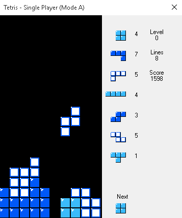
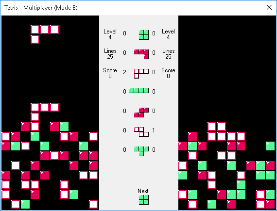

Tetris (single and multiplayer)
===============================

Introduction
------------

The objective of [Tetris](https://en.wikipedia.org/wiki/Tetris) is to place as much falling tetrominoes as possible in a playing field without filling it. When an horizontal line is full, it's cleared from the field and lines above are shifted down, granting the player some points. Over time have been devised many variations of this game's mechanics.

The Nintendo Entertainment System (NES) mechanics are the following:

- Only the seven tetrominoes are allowed (`O`, `I`, `J`, `L`, `Z`, `S` and `T` pieces)
- The game is played inside a `10x20` field
- Clearing more than one line at once grants more points (proportional to the current level)
- Every ten lines cleared, the game levels up and the falling speed increases up to level 20
- Only soft drop is allowed (the drop button makes the tetromino fall faster, but it won't land immediately, allowing the player to revert to normal falling speed). If a tetromino lands during soft drop, bonus points are given
- Wall kicking is not allowed (if the tetromino has no room for rotation, it won't rotate, instead of being pushed sideways)
- Mode A and mode B are available. The first is an endurance mode (the objective is to earn as many points as possible before a game over), the latter requires to clear a fixed number of lines (25) to win
- In mode B the playing field can be filled with random blocks up to an initial height chosen by the player
- There is also an unfinished two player mode, accessible through ROM hacking.

For more informations about the NES mechanics see: <https://meatfighter.com/nintendotetrisai>.

The following are some screenshots:

 

 

 

 

 

Features
--------

This C# program implements a Tetris game with multiplayer support (over TCP), with a look and feel as close as possible to the NES version. Both single player and multiplayer games can be started in mode A and mode B, with a starting level from 0 to 20 (the level is a `Int32`, so the maximum achievable level is 2^31, but speed won't increase after level 20). The *long levels* bug from the original NES game is **not** reproduced.

In multiplayer games, one player acts as a host and sets the initial parameters (mode, level and, in case of mode B, height) and the other acts as a guest. The communication protocol can be considered "lag resistant" because the informations shared with the counterpart are only required for displaying the playing field on the opponent's screen. All the game logic is kept locally.

Every program string is stored as a resource, to allow an easy localization of the game.

The controls (`MoveLeft`, `MoveRight`, `RotateLeft`, `RotateRight`, `Drop` and `Pause`) can be bound to any key through the settings form.

Remarks
-------

- Although the class `Tetris` allows to set width and height of the playing field (the forms use the default `10x20` playing field), the number of lines to be cleared in mode B is hardcoded to 25. This will be eventually refactored
- During a line clear, the line will simply disappear, without any graphical effect. This will eventually be solved by adding a new delegate (`void OnLineCleared(int lines)`)
- Multiplayer games travel over a TCP stream, but since every "packet" contains all the informations required to update the remote state in the opponent's window, a flow control for UDP datagrams would be almost trivial to implement (if a "packet" is corrupted ignore it, otherwise update the state), but would also require some error detection/correction mechanism. The "packet" size is small enough to guarantee good performances even over TCP, so it's not a big issue
- No bonus/malus is given in multiplayer mode (e.g. bonus score when clearing mode B before the opponent, four lines cleared trigger the rise of the opponent's field, etc.)
- There is no mechanism preventing a player who has lost a game to disconnect before acknowledging the opponent's score, but since the two scores aren't saved anywhere (requiring both players to send the same two scores to prevent a maliciously crafted "packet" with a fake score), it's not a big issue
- Sound is missing. There is no delegate which can be triggered by *panic mode* (blocks too high on the playing field cause the music to play faster) either.